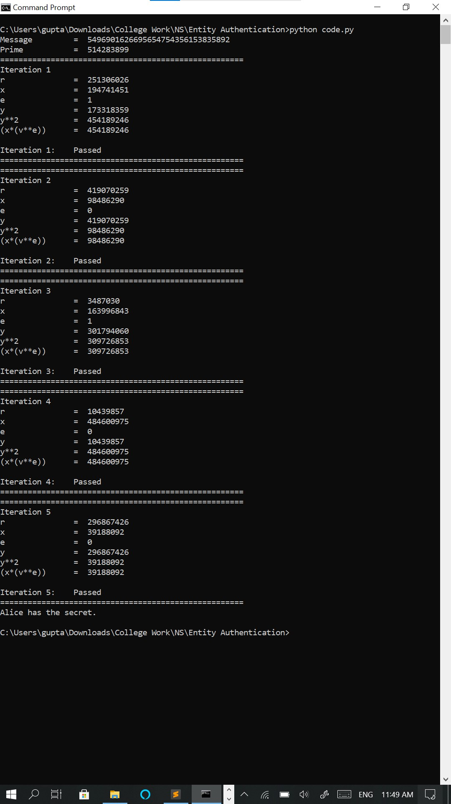

# Fiat Shamir Protocol
Python implementation of Fiat-Shamir Protocol.

## Installation
```bash
git clone https://github.com/noob-aViral/Fiat-Shamir-Python.git
cd Fiat-Shamir-Python
pip3 install -r requirements.txt
```
## Description
1. A chooses a random r in the interval (1, n-1) and sends r<sup>2</sup>%n to B.
2. B randomly selects a bit e (0 or 1) and sends it to A.
3. A computes (rv<sup>e</sup>)%n and sends it back to B.
4. Party B checks the equality y<sup>2</sup>=(xv<sup>e</sup>)%n. If it is true, it proceeds to the next round of the protocol, otherwise the proof is not accepted.

## Usage
```bash
python3 code.py
```

## Sample Output
<b>Note: </b> Output will be different for different run.

```python
Message         =  5496901626695654754356153835892
Prime           =  514283899
=====================================================
Iteration 1
r               =  251306026
x               =  194741451
e               =  1
y               =  173318359
y**2            =  454189246
(x*(v**e))      =  454189246

Iteration 1:    Passed
=====================================================
=====================================================
Iteration 2
r               =  419070259
x               =  98486290
e               =  0
y               =  419070259
y**2            =  98486290
(x*(v**e))      =  98486290

Iteration 2:    Passed
=====================================================
=====================================================
Iteration 3
r               =  3487030
x               =  163996843
e               =  1
y               =  301794060
y**2            =  309726853
(x*(v**e))      =  309726853

Iteration 3:    Passed
=====================================================
=====================================================
Iteration 4
r               =  10439857
x               =  484600975
e               =  0
y               =  10439857
y**2            =  484600975
(x*(v**e))      =  484600975

Iteration 4:    Passed
=====================================================
=====================================================
Iteration 5
r               =  296867426
x               =  39188092
e               =  0
y               =  296867426
y**2            =  39188092
(x*(v**e))      =  39188092

Iteration 5:    Passed
=====================================================
Alice has the secret.
```