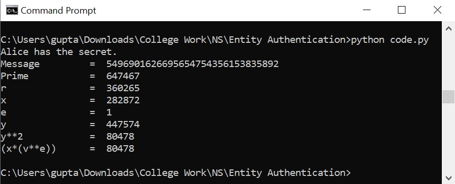

# Fiat Shamir Protocol
Python implementation of Fiat-Shamir Protocol.

## Installation
```bash
git clone https://github.com/noob-aViral/Fiat-Shamir-Python.git
cd Fiat-Shamir-Python
pip3 install -r requirements.txt
```
## Description


## Usage
```bash
python3 code.py
```

## Sample Output
<b>Note: </b> Output will be different for different run.

```python
Alice has the secret.
Message         =  5496901626695654754356153835892
Prime           =  647467
r               =  360265
x               =  282872
e               =  1
y               =  447574
y**2            =  80478
(x*(v**e))      =  80478
```